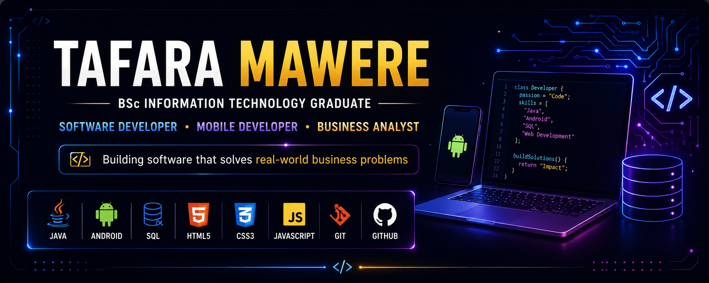

  

<h1 align="center">Hi 👋, I'm Tafara Mawere</h1>

<h3 align="center">BSc Information Technology Graduate</h3>

<h3 align="center">Software Developer | Mobile Developer | Business Analyst</h3>

  Building software that solves real-world business problems across desktop, web, and Android platforms

<h2 align="center"> 👨‍💻 About Me </h2>

- 🎓 BSc Information Technology Graduate from Richfield College
- 💻 Passionate about Software Development
- 💼 Business Analysis
- 📱 Mobile Development
- 🌐 Web Development
- 🗄  SQL & Database Design
- 🚀 Open to Graduate Programmes, Junior Developer, Software Engineer, and Business Analyst opportunities.

<h2 align="center"> 🛠 Tech Stack </h2>

### Languages

### Mobile

### Databases

### Tools

### 🛠 Development Tools

<h2 align="center"> 📊 GitHub Statistics </h2>

<!-- I dont want hub stats RN
  
-->
<h3 align="center"> Languages I've used across my projects </h3>

  

<h2 align="center"> 🚀 My Projects </h2>

### 🖥️ Pharmacy Inventory Management System
> Desktop application for managing pharmacy inventory, sales, reporting, and user administration.

📸 *Screenshot coming soon.*

🔗 **Repository:** *(Link will be added once published)*
<!--

Screenshots Example

| Login | Dashboard |
|-------|-----------|
|  |  |

| Inventory | Reports |
|-----------|----------|
|  |  |
-->

---

### 🖥️ Business Inventory Management System

<!--

-->

---

### 🌐 Training Booking Website
> Full-stack booking platform allowing users to register, book training sessions, and manage course information.

📸 *Screenshot coming soon.*

🔗 **Repository:** *(Coming soon)*

<!--

-->

---

### 📱 Contact Management App
> Android application for creating, storing, and managing contacts with an intuitive mobile interface.

📸 *Screenshot coming soon.*

🔗 **Repository:** *(Coming soon)*

---
<!--

-->

#### 📱 Restaurant Rater

> Android application allowing users to browse restaurants and rate dishes using a modern mobile interface.

📸 *Screenshot coming soon.*

🔗 **Repository:** *(Coming soon)*

<!--

-->

---

### 🌐 Tic-Tac-Toe Website
<!-- **Projects cards... gonna add later**

-->

### 🌐 Quiz-Website
<!--

-->

### 🌐 My-Portfolio
> Personal portfolio showcasing my projects, technical skills, and software development journey.

📸 *Screenshot coming soon.*

🔗 **Repository:** *(Coming soon)*

<!--

-->

---

<h2 align="center"> 📖 Currently Learning </h2>

- Business Intelligence & Data Analytics
- UI/UX Design With Figma
- Python for Beginners
- REST APIs
- Cloud Computing

<!--
## 📜 Certifications

- Business Intelligence & Data Analytics
- UI/UX Design With Figma
- Python for Beginners
-->

<h2 align="center"> 🎯 Career Goals </h2>

I'm passionate about developing software that solves real-world business problems.

Currently looking for opportunities in:

- Graduate Software Development
- Junior Software Engineering
- Mobile Application Develpment
- Business Analysis
- IT Support & Systems

<h2 align="center"> 📫 Feel Free To Reach Out To Me </h2>

<!-- Add Live portfolio

-->

